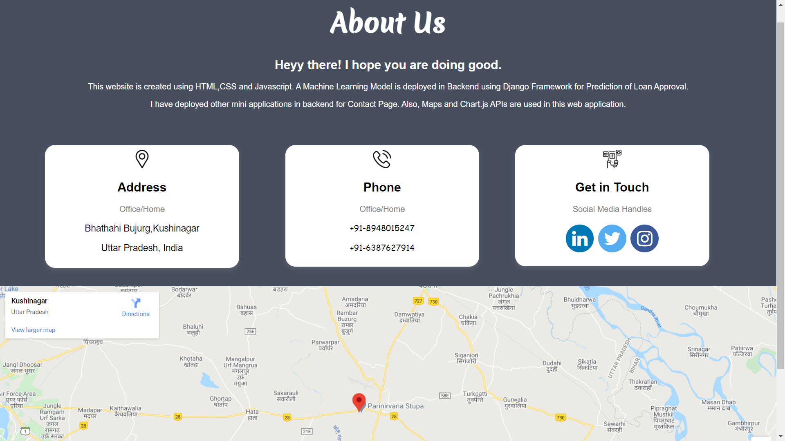

<h4> Contributor: Nitin Sanatan(11807742) </h4>

# Credit Approval Prediction
A website that predicts whether a loan will be accepted or rejected, based on User Input

## Objectives
In finance, a loan is the lending of money by one or more individuals, organizations, or other entities to other individuals, organizations etc. The recipient (i.e., the borrower) incurs a debt and is usually liable to pay interest on that debt until it is repaid as well as to repay the principal amount borrowed. In order to check the eligibility of the borrower, banks check few informations like Income, Age, Family Income etc. to confirm/reject the loan request. 
**Credit Approval Website** is prepared to assist any lending organization in properly checking all the data of the recipient and predict whether an individual is eligible for loan or not, based on past data.

## Technology Used
- Python3
- Django Framework
- Pandas
- Numpy
- Sklearn
- Seaborn
- HTML
- CSS
- Javascript

## Model Description
This is a Classification Probelm where system will predict if a loan will be approved or not. I have employed a Machine Learning Model to process the user input at backend.
Model is preprocessed and missing values are removed. Hyperparameter tuning is done to get best parameters for data training. Data is trained using 3 techniques; SVM, KNeighbors &
Random Forest Model. Confusion Matrices are utilised for evaluation of accuracy score of models.

- ## Feature Engineering
> Our dataset is contains 690 rows and 16 columns, where first 15 columns are data and last column is showing the Class(+,-) of whether loan is accepted or rejected. There are 9 attributes which contains **Categorical Data** and rest are **Continuous**. Missing values are also there in data denoted by **'?'** 

### Feature Identification

### Handling Missing Data

### Label Encoding for Categorical Data

### Plotting of dataset

- ## Training of Data
> Dataset was normalized to change the numerical values of different columns and scaled to same level. Dataset was split into *72% train data* and *28% test data*. Later, Data was trained using 3 different models **(SVM, KNeighbours, Random Forest Classifier)**

### Train-Test-Split

### Training

- ## Hyperparameter Tuning
> Hyperparameter optimization is performed in order to discover the set of specific model configuration arguments that result in the best performance of the model on a specific dataset. For Example, What should be the kernel or C of a SVC, to obtain best results. Hyperparameter tuning was done for all 3 models and best parameters were selected for our model training.

### Hyperparamter Optimization

### Training our Model on Best Obtained Parameters

- ## Model Evaluation using Confusion Matrix
> Confusion Matrices are used to calculate the accuracy of model. We can find out Precision, Recall & F1 Score too using *classification_report.* Accuracy Score is calculated by using the formula: { confusion_matrix.trace() / confusion_matrix.sum() }, where trace() will give the sum of TP & TN and sum() gives the sum of all elements(TP, TN, FP & FN).
> Best Accuracy Score was obtained from **K-Neighbors Classifier** after hyperparameter optimization. Accuracy obtained is **91%** with only **17 misclassified samples**

### Confusion Matrix for KNeighbors
 

## Implementation
After training my model, I have saved it as a *pickle (.sav file)* which can be easily loaded for further use. I have used **Python Django Framework** for utilising my saved model and to make predictions.

- ## About Website
> My website contains a Home Page, Prediction Page, Results Page, Contact & About Us page. Technologies of web development like **HTML5, CSS, JavaScript & Web APIs** are used to make different templates for the application. My Best performing model (K-Neighbors Classifier) is implemented in Backend using Django for predicting the output based on user inputs. 

### Home Page

### Prediction Page
> This Page contains input values in the form of A1, A2 etc. because the dataset was converted to meaningless values to protect the confidentiality of data.

### Result Page

### Contact Page

### About Us Page

## Conclusion
> This project deals with basic machine learning applications and gave insights on how to implement a model in the backend using Django. The dataset was filled with meaningless attributes to maintain the confidentiality of the customers, that's why the attributes are in form of A1, A2 and not in real world applications. I have observed that 3 all the models performed decent with the dataset after *Simple Imputation with most-frequent strategy* to remove missing values. Accuracy of **SVM, K-Neighbors, Random Forest Model** evaluated from *Confusion Matrices* are **88%, 91% and 90%** respectively. Hyperparamter Optimization gave the best parameters and hence improved accuracy of models by around 2-3%. 

## Contact me  [![Twitter][1.2]][1]  [![LinkedIn][2.2]][2]

<!-- Icons -->

[1.2]: http://i.imgur.com/wWzX9uB.png
[2.2]: https://raw.githubusercontent.com/MartinHeinz/MartinHeinz/master/linkedin-3-16.png

<!-- Links to your social media accounts -->

[1]: https://twitter.com/SanatanShukla58
[2]: https://www.linkedin.com/in/nitinsanatan/
